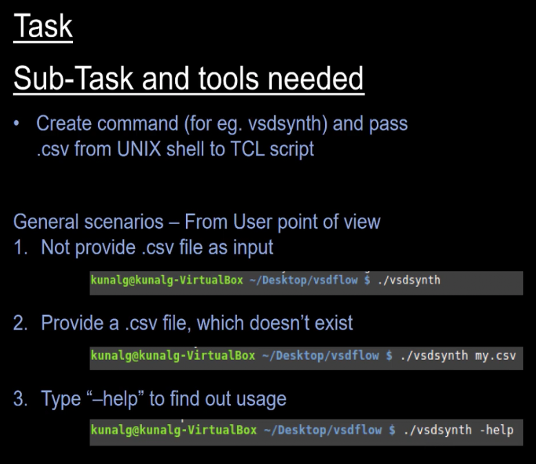
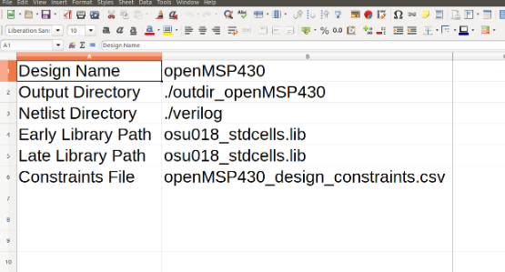
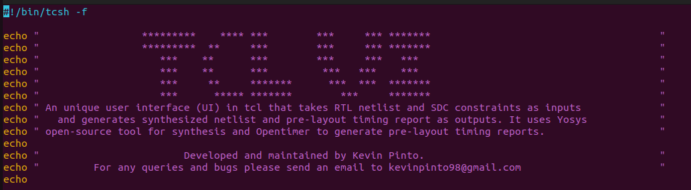
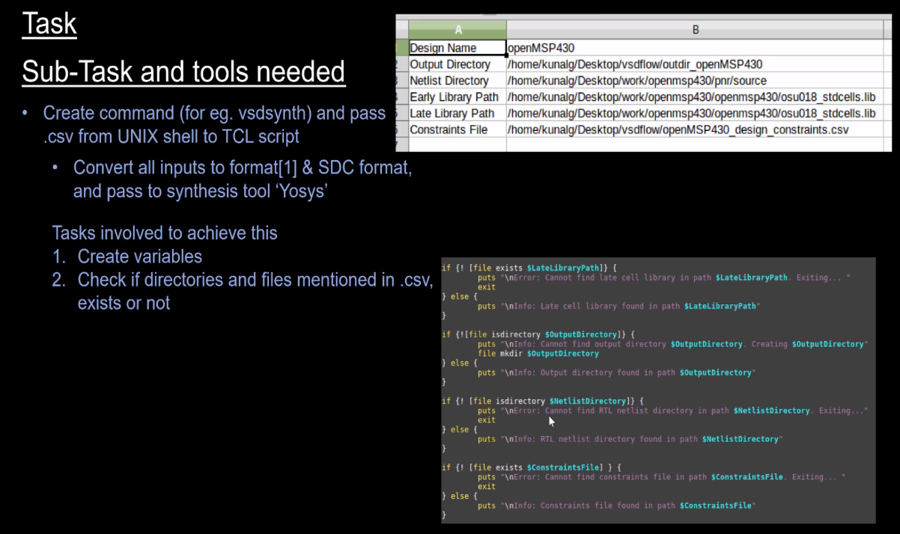
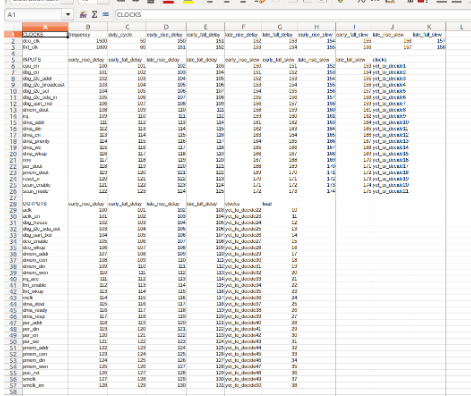
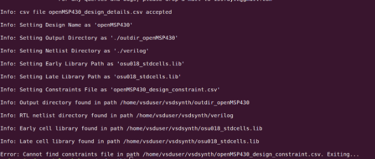
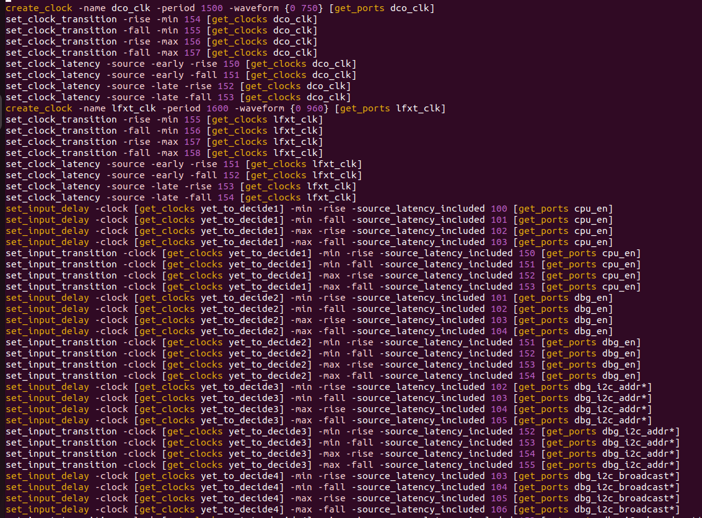
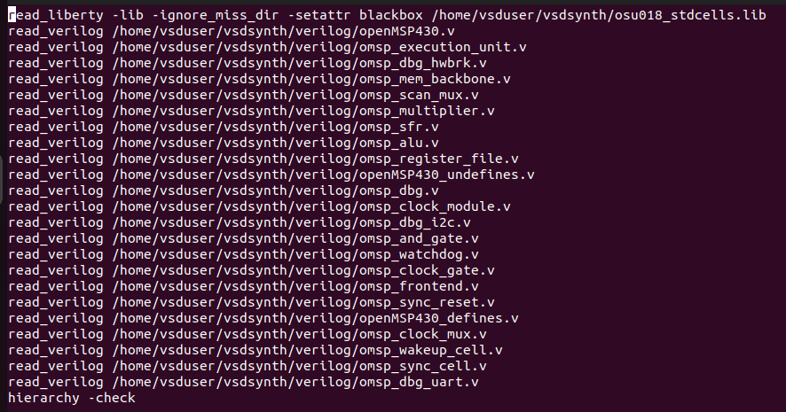
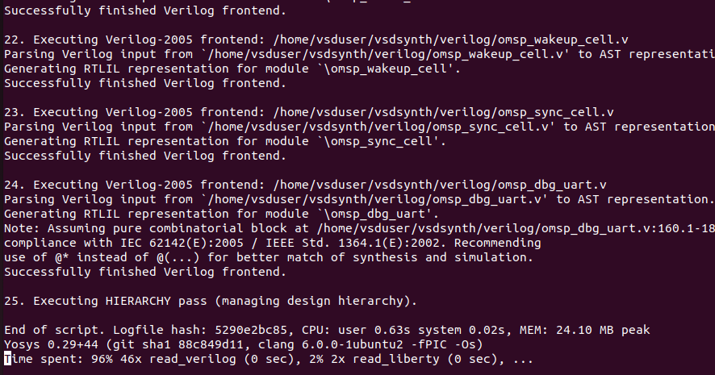

# VSD_TCL_Workshop
This 5-day tcl workshop by vlsi system design (VSD) is intended to familiarize th eparticipants with the fundamentals of tcl scripting and how it can be used in conjunction with open-source EDA tools such as Yosys and opentimer by acting as an interface that takes the input design in the form of a .csv file and generates various reports such as timing in order to gauge if the design can be sent for fabrication.

## Day1: Introduction to TCL and VSDSYNTH Toolbox Usage
During day 1 the main task was writing a shell script (i.e. tclui) which further calls the tcl script (tclui.tcl) assuming the correct input (.csv file) is provided else it displays an appropriate message depending on the error.

The main scenarios being covered by the shell scripts in terms of the types of inputs the script can handle have been mentioned in the figure below:

A snapshot of the input file (openMSP430_design_details.csv) is indicated below:

A glimpse of the interface provided by the tclui command (i.e. tclui shell script) is:

## Day 2: Variable Creation and Processing Constraints from CSV
The steps involved in day 2 are summarized in the figure below:

The input constraints file (openMSP430_design_constraints.csv) is shown in the image below:

The output after setting the appropriate variables to the necessary ibrary files and directories is as follows:

## Day 3: Processing Clock and Input Constraints
The tasks for day 3 mainly involved processing the constraints as mentioned in the .csv for the various clocks, inputs and outputs and generating the appropriate synopsys design constraints (SDC) commands that would further be used in the .sdc file.

A snapshot of a section of the final SDC file generated is as shown below:

## Day 4: Complete Scripting and Yosys Synthesis Introduction
Day 4 mainly involved tasks related to performing hierarchy checks and error handling for the Yosys synthesis tool.
The script to check the hierarchy is present in the file openMSP430.hier.ys in the output directory outdir_openMSP430. A snapshot of the hierarchy check file is shown below:

The errors and outputs of the synthesis process can be found in the log file openMSP430.hierarchy_check.log in the output directory outdir_openMSP430. A snapshot of the output log file is shown below:

# Acknowledgements
  - [Kunal Ghosh](https://github.com/kunalg123), Co-founder, VSD Corp. Pvt. Ltd.